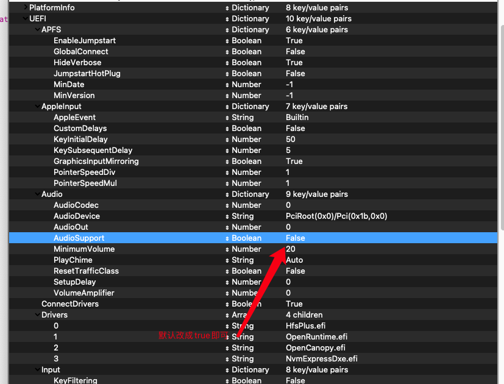

## GUI说明
- Open Core 0.6.9开始，就 GUI 而言，OC 版本显示在开始屏幕中
- 
- PickerAttributes = 65（自定义图标 + 最小用户界面，无指针）
- PickerAttributes = 17（自定义图标 + 完整 Ui + 指针）
- 在开机画面中隐藏 OC 版本  ExposeSensitiveData = 2 (默认 6)
- 对于那些在启动时使用密码锁定 GUI 并希望加快解密速度的人，设置  EnableVectorAcceleration = YES
## USB问题说明
- 遇到机型Mac Pro6,1机型无法驱动USB这种情况：
- 首先进行插拔，然后下载仓库内最新提交中的USB驱动更换发布版中的即可解决
- 如果要使用其它机型建议安装好后自行定制，完成后在修改机型
## 关于开机音频

- 目前测试，AudioDxe.efi开机加载非常缓慢暂时不建议使用
- 开启方式非常简单,添加AudioDxe.efi，到EFI目录并且起用。
- 参考如下参数打开即可


## 关于主板背光
- a)无背光状态，亮度昏暗，亮度调节不可用 --->检查WhateverGreen.kext驱动工作是否正常，或者说没有开启
- b)有背光但是灰色无法拉动 --->使用第三方软件可调节
- c)背光确定正常，但是就不可调节 --->检查是否有FN按键锁，这个问题一般发生在机械键盘用户
## 开机引导参数说明
参数 | 功能
:--- | :---
**-v** | **故障调试模式，显示所有调试日志（含错误信息)**
**-s** | **单用户模式：不能正常进入系统时采用，脱离图形界面，以命令行方式进入**
**npci=0x2000** | **解决独立显卡PCIconfiguration begin卡住不动**
**npci=0x3000** | **解决独立显卡PCIconfiguration begin卡住不动**
**alcid=1** | **声卡注入id**
---

## Fusion Drive（融合硬盘技术) 
### 创建方法
- 1. 列出所有磁盘:
- ```diskutil list```
- 2. 建立一块 fusion drive:
- ```diskutil cs create "Cheney Fusion Drive" disk0 disk1```
- 建立完成后，它会告诉你一个uuid，复制下来。
- 3. 给这个 fusion drive 分区:
- ```diskutil cs createVolume BDF819F4-06C0-4D49-943A-1A23E8B20928 jhfs+ "Macintosh FD" 100%```
- 到这里你可以发现所有磁盘变成一块磁盘了 然后正常的使用磁盘工具抹盘安装即可了！
- 注意要使用该技术必须在安装时候进行该操作，操作后不可拆分，如果拆分会损失数据，请自行选择是否使用！
